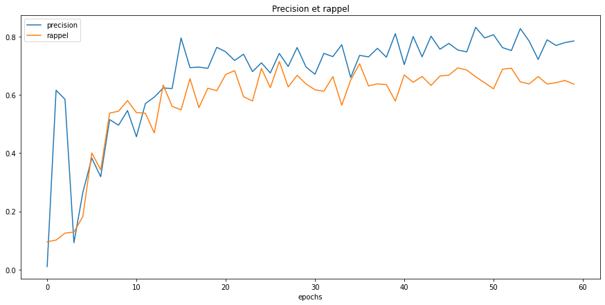

# Détection d'incendies avec Yolo (version5) et Streamlit

## Introduction : 

Le but de l'application est faire la détection par webcam est temps réel, en faisant la distinction entre feu et incendie.   

L'ordinateur à disposition, peu puissant, ne permet pas de traiter un flux vidéo constant, aussi l'application se fait en détection d'images pour test, mais doit faire l'impasse sur le traitement par webcam et le traitement de vidéos.  

<u><i>éthique : </i></u>   

La vidéo-surveillance créé des entraves aux libertés individuelles et collectives, l'application ne peut pas être utilisée telle quelle puisqu'elle permet la reconnaissance de personnes.

## Application : 

> exécuter les cellules du notebook <i>main.ipynb</i>

## Labellisation de photos à partir le la webapp 'Make Sense'  

#### Import des photos selon l'architecture suivante : 

<b>yoloo</b>   
------ photos   
------------ <i>train</i>   
------------ <i>val</i>   
------ labels   
------------ <i>train</i>   
------------ <i>val</i>       

Création de deux labels : 
- feu  (0)  
- incendie (1)    

Labellisation des images manuellement, puis import des fichiers textes des labels.

## Entraînement sur Google Colab :  

> dossier de travail : /content   

- import des photos et des labels (dossier compressé), décompression  
- création d'un fichier de configuration yaml (<i>custom_data.yaml</i>)
- entraînement par data-augmentation avec GPU : 
    - poids : yolov5x.pt
    - labels :
        - 0 : feu
        - 1 : incendie

## Test en local : 

> à partir d'une vidéo (<i>video.mp4</i>), détection des feux et incendies (<i>video_2.mp4</i>)   

## Application : 

seule la détection d'images est activée, pour cause de ressources RAM limitées.  

## Analyse

Yolov5 effectue de bonnes prédictions sur ces images de validations :  

### Métrique de décision : 

la métrique de décision du meilleur modèle pour l'entraînement du modèle est la <i>mean Average Precision</i>, une moyenne des différents F1 scores de deux labels, <i>feu</i> et <i>incendie</i>.  

On note un meilleur F1_score pour le <i>le feu</i> :

  

Voici les courbes moyennes de Rappel et précision :  

Celles-ci semblent suffisamment hautes pour obtenir une bonne détection. En fonction du projet, un ré-entraînement pourrait être possible avec une métrique différente  afin de :  
- voir si on veut une excellente détection des incendies, mais quelques fausses alertes faisant appel à un opérateur humain plus régulièrement (precision plus élevée, rappel plus faible), 
- une automatisation : rappel plus élevé, précision plus faible
- mieux faire la distinction entre un feu et un incendie (création de deux modèles différents, avec tuning plus précis du rappel et de la précision)

Voici la matrice de confusion à titre informatif : 

